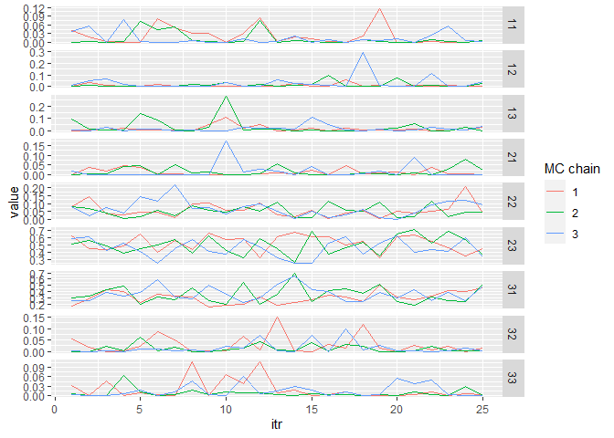

<!-- README.md is generated from README.Rmd. Please edit that file -->

# magma.gsi 

<!-- badges: start -->
<!-- badges: end -->

*MAGMA* is a slowing moving but powerful model that combine mark and age
information with genetic mixture analysis. Mainly, *MAGMA* estimates two
sets of parameters: stock and age. A composition of the two, information
that is often required for run reconstruction models, is simply the
product of these two sets of parameters. After all age/stock
compositions in other strata are calculated in the same fashion, they
are multiplied by the harvest proportions of their corresponding strata
and summed up to get a weighted average age/stock composition.

## Installation

You can install the development version of *magma.gsi* from
[GitHub](https://github.com/boppingshoe/magma.gsi) with:

``` r
# install.packages("devtools")
devtools::install_github("boppingshoe/magma.gsi", build_vignettes = TRUE)
```

## Example

Once you have the data sets up at a designated directory, you can
compile the input object:

``` r
library(magma.gsi)

wd <- getwd() # path to data folder
magma_data <- magmatize_data(wd = paste0(wd, "/vignettes"), save_data = FALSE)
#> Compiling input data, may take a minute or two...
#> No missing hatcheries
#> Time difference of 8.497116 secs
```

Run the model:

``` r
magma_out <- magmatize_mdl(magma_data, nreps = 50, nburn = 25, thin = 1, nchains = 3)
#> Running model (and the category is... Working Girl!)
#> Time difference of 1.875498 secs
#> 2023-08-28 16:53:04.916118
```

Summarize the results:

``` r
magma_summ <- magmatize_summ(ma_out = magma_out, ma_dat = magma_data, summ_level = "district", type = "age")
#> Preparing output (patience grasshopper...)
#> Time difference of 0.5085111 secs
#> 2023-08-28 16:53:05.466014

magma_summ$age_summ[1]
#> $`(1)_D1_Koyukuk`
#> # A tibble: 9 × 10
#>   group   age     mean  median     sd       ci.05  ci.95     p0    GR n_eff
#>   <chr>   <chr>  <dbl>   <dbl>  <dbl>       <dbl>  <dbl>  <dbl> <dbl> <dbl>
#> 1 Koyukuk 11    0.0167 0.00545 0.0261 0.000000986 0.0720 0.187  1.06   43.9
#> 2 Koyukuk 12    0.0249 0.00903 0.0411 0.0000344   0.103  0.0933 1.12   75  
#> 3 Koyukuk 13    0.0162 0.00605 0.0264 0.0000189   0.0850 0.173  1.05   66.8
#> 4 Koyukuk 21    0.0209 0.00514 0.0327 0.0000253   0.0862 0.12   1.05   75  
#> 5 Koyukuk 22    0.0632 0.0485  0.0506 0.00471     0.167  0.0267 1.15   75  
#> 6 Koyukuk 23    0.555  0.562   0.112  0.387       0.731  0      1.04  116. 
#> 7 Koyukuk 31    0.271  0.271   0.101  0.118       0.432  0      1.10   75  
#> 8 Koyukuk 32    0.0135 0.00416 0.0214 0.0000177   0.0541 0.16   0.984  75  
#> 9 Koyukuk 33    0.0182 0.00608 0.0261 0.00000468  0.0823 0.107  1.01   75
```

There’s a function in the package to make trace plots and inspect mixing
of chains.

``` r
tr_plot(magma_summ$age_prop[[1]])
```



To see more examples on using *magma.gsi*, you can call the manual using
`vignette("magma-vignette", package = "magma.gsi")` after you installed
*magma.gsi*.
