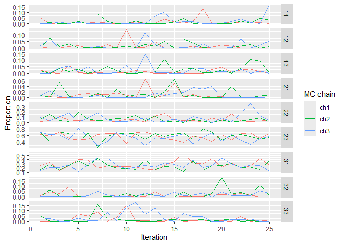

<!-- README.md is generated from README.Rmd. Please edit that file -->

# magma.gsi

<!-- badges: start -->
<!-- badges: end -->

*MAGMA* is a slowing moving but powerful model that combine mark and age
information with genetic mixture analysis. Mainly, *MAGMA* estimates two
sets of parameters: stock and age. A composition of the two, information
that is often required for run reconstruction models, is simply the
product of these two sets of parameters. After all age/stock
compositions in other strata are calculated in the same fashion, they
are multiplied by the harvest proportions of their corresponding strata
and summed up to get a weighted average age/stock composition.

## Installation

You can install the development version of magma.gsi from
[GitHub](https://github.com/boppingshoe/magma.gsi) with:

``` r
# install.packages("devtools")
devtools::install_github("boppingshoe/magma.gsi", build_vignettes = TRUE)
```

## Example

Once you have the data sets up at a designated directory, you can
compile the input object:

``` r
library(magma.gsi)

wd <- getwd() # path to data folder
magma_data <- magmatize_data(wd = wd, save_data = FALSE)
#> Compiling input data, may take a minute or two...
#> No missing hatcheries
#> Time difference of 14.4887 secs
```

Run the model:

``` r
magma_out <- magmatize_mdl(magma_data, nreps = 50, nburn = 25, thin = 1, nchains = 3)
#> Running model (and the category is... High Class In A Fur Coat!)
#> Time difference of 14.10798 secs
#> 2023-08-11 15:58:19.739176
```

Summarize the results:

``` r
magma_summ <- magmatize_summ(ma_out = magma_out, ma_dat = magma_data, summ_level = "district", type = "age")
#> Preparing output (patience grasshopper...)
#> Time difference of 0.860641 secs
#> 2023-08-11 15:58:20.685513

magma_summ$age_summ[1]
#> $`(1)_D1_Koyukuk`
#> # A tibble: 9 × 10
#>   group   age     mean  median     sd      ci.05  ci.95     p0    GR n_eff
#>   <chr>   <chr>  <dbl>   <dbl>  <dbl>      <dbl>  <dbl>  <dbl> <dbl> <dbl>
#> 1 Koyukuk 11    0.0163 0.00442 0.0251 0.000106   0.0749 0.0667 1.01   75  
#> 2 Koyukuk 12    0.0179 0.00596 0.0387 0.0000188  0.0700 0.147  1.01   75  
#> 3 Koyukuk 13    0.0217 0.00680 0.0410 0.0000860  0.0985 0.0667 1.03   75  
#> 4 Koyukuk 21    0.0158 0.00540 0.0266 0.00000870 0.0536 0.16   1.08   75  
#> 5 Koyukuk 22    0.0618 0.0527  0.0437 0.00632    0.126  0      0.994 122. 
#> 6 Koyukuk 23    0.494  0.496   0.117  0.308      0.665  0      1.06   82.3
#> 7 Koyukuk 31    0.339  0.315   0.118  0.181      0.529  0      1.05   75  
#> 8 Koyukuk 32    0.0189 0.00537 0.0295 0.0000286  0.0768 0.12   1.02   66.2
#> 9 Koyukuk 33    0.0142 0.00435 0.0230 0.00000701 0.0618 0.187  0.998  60.3
```

There’s a function in the package to make trace plots and inspect mixing
of chains.

``` r
tr_plot(magma_summ$age_prop[[1]])
```



To see more examples on using MAGMA, you can call the manual using
`vignette("magma_vignette")` after you installed *magma.gsi*.
