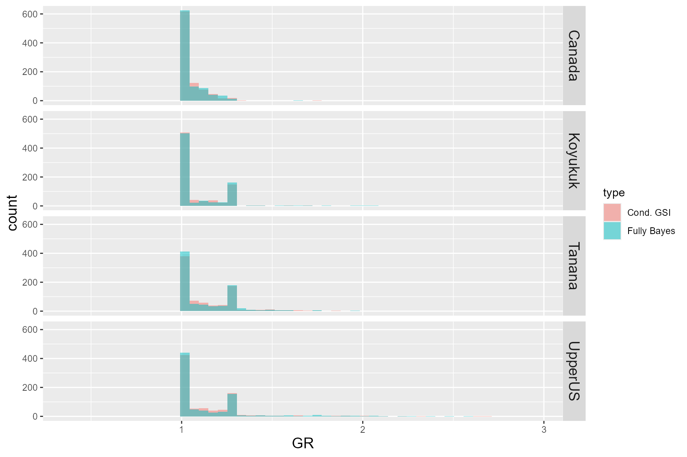
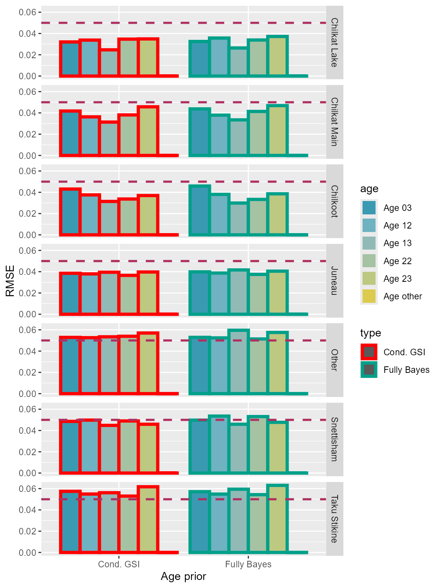
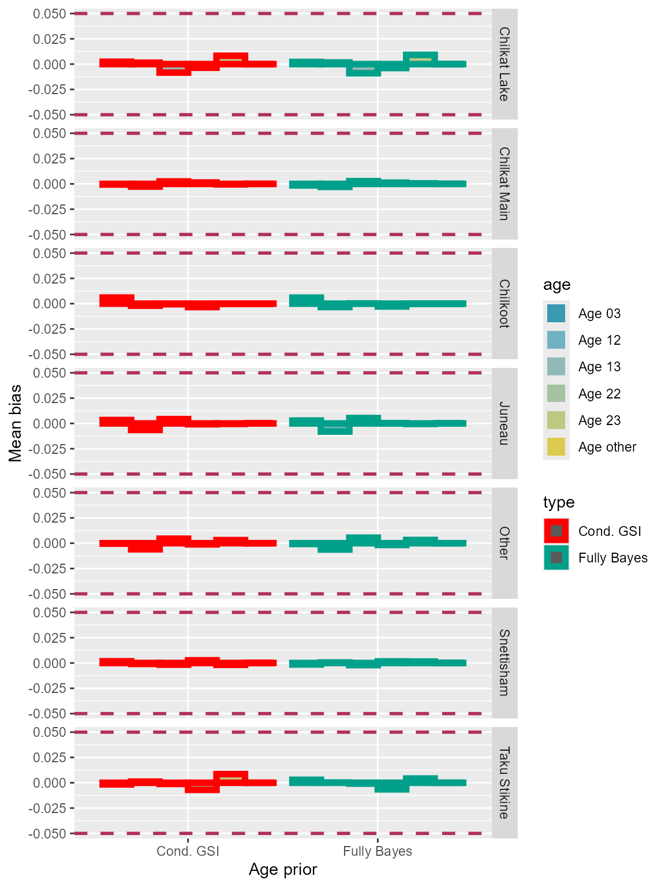
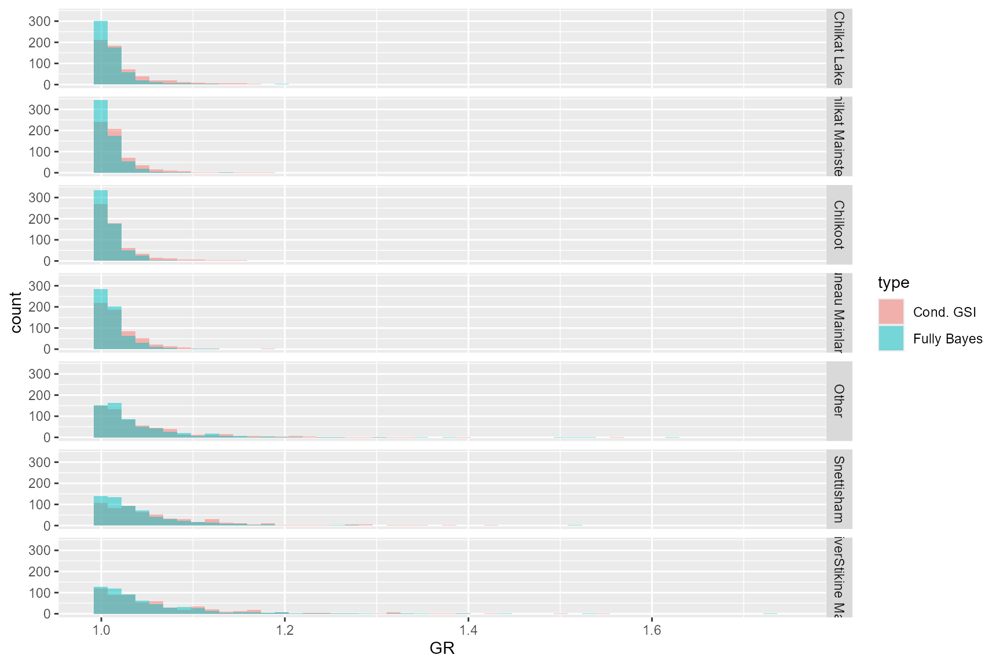

# Comparing MAGMA model algorithms

## Objectives

- Compare model algorithms of “fully Bayesian” and “conditional GSI” of
  MAGMA by assessing error, deviation, bias and MCMC convergence of the
  estimates.

## Background

MAGMA is a Bayesian mixture model used for GSI applications. When we
“run” the MAGMA model, we employ a MCMC algorithm to estimate stock
proportions, age-by-stock composition, and individual group membership
assignments. MAGMA algorithm is modified from a mixture model first
developed by Pella and Masuda (2001; i.e., Pella-Masuda model or “fully
Bayesian” model). The underlying principles of MAGMA and Pella-Masuda
models are the same, except that MAGMA incorporates age and marking
information in addition to the genetics. Also, MAGMA is designed for
analyses containing multiple strata, which makes running MAGMA model
more computationally intensive than the Pella-Masuda model.

That is not to say that the Pella-Masuda model is simple; it has an
intricate algorithm and running the program BAYES can be a
time-consuming process. To decrease time spent on running the model (and
improve convergence of the MCMC sampler), Moran and Anderson (2018)
developed a conditional mixture model by modifying the Pella-Masuda
model. The conditional model (i.e., “conditional GSI”) streamlines the
fully Bayesian algorithm by eliminating a step to recalculate allele
frequencies of the baseline populations. This step is often referred to
as “baseline re-sampling,” where, at each iteration of MCMC sampling,
mixture individuals are assigned a new population membership, and the
allele frequencies of each population can shift due to changes in its
membership. Therefore, in the fully Bayesian algorithm, allele
frequencies are re-calculated at each iteration. This step can be
computational intensive with a large mixture sample and/or a big genetic
marker set.

Moran and Anderson (2018) found that the baseline re-sampling step can
be mathematically integrated out of the model algorithm, and the
resulting conditional model would yield the same results as the fully
Bayesian model without the computationally intensive calculations. We
incorporate the conditional model in the sampling algorithm for MAGMA,
but with some modifications to incorporate age and marking information.
Basically, our modifications to MAGMA algorithm are a hybrid of the
fully Bayesian and the conditional models.

However, we have not assessed the effects of the hybrid model on the
estimation in a MAGMA setting. In this document, I use a
cross-validation analysis to assess the possible effects of the hybrid
conditional GSI on the accuracy and precision of the MAGMA model.

### Update for October 2024 (Lynn Canal)

I updated the analysis with Lynn Canal sockeye baseline and a
multi-stratum set up. Lynn Canal post-season reporting has 251
collections divided into seven groups. Majority of collections are
included in the “Other” reporting group. For age, there are 15 classes
total. Five of them are major age classes (03, 12, 13, 22, 23), and the
rest are included in “other.”

## Methods

### Yukon Chinook

I used a Yukon Chinook baseline for the simulation. The Chinook baseline
was modified in a previous analysis and contained only a portion of the
original collections. This modified baseline had a marker-set of 380
loci that could differentiate Chinook salmon among four reporting groups
from the middle/upper Yukon River (Koyukuk, Tanana, Upper U.S., and
Canada; Lee et al. 2021). I used the modified baseline to generate 100
sets of MAGMA mixtures (one district, one subdistrict, and one week)
with randomly set age-by-stock compositions, and ran the mixtures using
hybrid conditional GSI and fully Bayesian algorithms. Finally, I
calculated and compared root mean-square-errors (RMSE), deviations, and
mean bias for the 100 simulations.

Procedures for generating one set of MAGMA data are as follows:

1.  Randomly set proportions for the four reporting groups. Based on the
    set proportions, randomly allocate 190 individuals to populations
    within each reporting group.

2.  Simulate genotypes of mixture individuals based on the baseline
    allele frequencies corresponding to their assigned population
    memberships. The simulated values are drawn from multinomial
    distributions.

3.  randomly set proportions for the age-by-stock compositions. The
    age-by-stock composition is a $`4 \times 9`$ matrix with rows
    represent reporting groups and columns represent age classes. There
    are nine age classes and they are ages 1.1, 1.2, 1.3, 2.1, 2.2, 2.3,
    3.1, 3.2, and 3.3. The proportions for ages 1.1, 1.2, and 3.3 are
    always 0’s in this analysis, and the rest are randomly set. The age
    proportions within each reporting group add up to 1.

4.  Assign an age for each mixture individual based on its assigned
    reporting group membership. Randomly withheld the age identities for
    15% of the mixture individuals.

5.  Format the data set for MAGMA model (using `magmatize data()`
    function). There is only one district, one subdistrict, and one week
    in the mixture data set.

I ran each of the 100 MAGMA data sets with two model algorithms: 1)
“conditional GSI”: a hybrid algorithms that re-sample baseline allele
frequencies every 10th iteration and 2) “fully Bayesian”: re-sample
baseline allele frequencies every iteration. I ran each model with 1,000
iterations, 500 burn-ins, no thinning, and four chains with “zero out”
age priors.

I compared the posterior means and the true proportions of the nine age
classes and calculated RMSE and bias/deviation. RMSE is calculated as
$`\sqrt{\frac{1}{n} \sum_{i=1}^{n} (Y_i - \hat Y_i)^2}`$, where $`n`$
was the number of cross-validation analyses, $`Y_i`$ was the true
proportion of age $`y`$ for the $`i`$^(th) analysis, and $`\hat Y_i`$
was the posterior mean proportion of age $`y`$ for the $`i`$^(th)
analysis. Mean bias was the mean of the differences between the
posterior mean and the true proportion of each age class for each
cross-validation analysis. “Deviation $`\geq`$ 0.1” quantified the
portion of the cross-validation analyses with absolute biases greater or
equal to 0.1.

### Update for October 2024 (Lynn Canal)

Simulations for Lynn Canal followed the same procedures as before, with
addition of multiple strata. There were one district and two
subdistricts with two weeks each. Age-by-stock composition was a
$`7 \times 15`$ matrix for the whole district. I ran two sets of
simulations. The first set had 0 portion for all minor age classes. The
second set had a small portion (randomly set) for some of the minor age
classes.

Harvest were randomly selected from the 2023 harvest record to represent
a simulated harvest for the four strata in each iteration of the
analysis. Sample size for each stratum was randomly drawn from a
negative binomial distribution with a mean of 190 fish and a dispersion
parameter of 8 (Neg-bin($`\mu`$ = 190, size = 8)).

## Results

### Yukon Chinook

#### Precision

I plotted the comparisons between the posterior means and the true
values and the performances were similar between the two algorithms for
the four reporting groups (Figure 1).

 Figure
1: Comparison between the posterior means and the true values of the 100
cross-validation analyses for the two model algorithms: ‘Cond. GSI’ and
‘Fully Bayes.’ Diagonal line represents 1:1 relationship between the
true proportions and the posterior means. Dashed lines mark the ± 0.1
deviation from the 1:1 line.

#### RMSE

The performances of the two algorithms were similar. If you squint
really hard, you might find that conditional GSI had slightly lower
RMSE’s for Koyukuk and Tanana (Table 1; Figure 2).

Table 1: Comparison of root mean-square-errors for each age class among
the two model algorithms.

 Figure 2: Root
mean-square-errors of each age class for the two model algorithms.

#### Bias

The two algorithms of MAGMA exhibited similar amount of biases (or lack
thereof) for the four reporting groups (Figure 3).

 Figure 3: Bias of
each age class for the two model algorithms.

#### Deviation $`\geq`$ 0.1

Hybrid conditional GSI seemed to perform slightly better than fully
Bayesian algorithm overall (Table 2; Figure 4).

Table 2: Comparison of deviation $`\geq 0.1`$ for each age class among
the two model algorithms.

 Figure 4:
Deviation $`\geq`$ 0.1 of each age class for the two model algorithms.

#### Gelman-Rubin diagnostic (GR)

I also compared the convergence of the posterior samples between the two
algorithms by plotting the Gelman-Rubin shrink factor (GR) of 100
simulations in overlapping histograms (Figure 5). The convergence seemed
to be similar between the two algorithms.

Figure 5: Gelman-Rubin diagnostic (GR) of each reporting group for the
two model algorithms.

### Update for October 2024 (Lynn Canal)

#### Precision

Comparisons between the posterior means and the true values showed that
the performances were similar between the two algorithms for the seven
reporting groups of the Lynn Canal sockeye baseline (Figure 6).

Figure 6: Comparison between the posterior means and the true values of
the 100 cross-validation analyses for the two model algorithms, ‘Cond.
GSI’ and ‘Fully Bayes,’ using the Lynn Canal sockeye baseline. Diagonal
line represents 1:1 relationship between the true proportions and the
posterior means. Dashed lines mark the ± 0.1 deviation from the 1:1
line.

#### RMSE

Errors of the two algorithms were similar for the Lynn Canal sockeye
baseline (Table 3; Figure 7).

Table 3: Comparison of root mean-square-errors for each age class among
the two model algorithms.

Figure 7: Root mean-square-errors of each age class for the two model
algorithms using Lynn Canal sockeye baseline.

#### Bias

The two algorithms of MAGMA exhibited similar amount of biases for the
seven reporting groups of the Lynn Canal sockeye baseline (Figure 8).

Figure 8: Bias of each age class for the two model algorithms using Lynn
Canal sockeye baseline.

#### Deviation $`\geq`$ 0.1

The two model configurations seemed to have similar performance with
Lynn Canal sockeye baseline (Table 4; Figure 9).

Table 4: Comparison of deviation $`\geq 0.1`$ for each age class among
the two model algorithms.

Figure 9: Deviation $`\geq`$ 0.1 of each age class for the two model
algorithms using Lynn Canal sockeye baseline.

#### Gelman-Rubin diagnostic (GR)

I also compared the convergence of the posterior samples between the two
algorithms by plotting the Gelman-Rubin shrink factor (GR) of 100
simulations in overlapping histograms (Figure 10). The convergence
seemed to be similar between the two algorithms with Lynn Canal sockeye
baseline.

Figure 10: Gelman-Rubin diagnostic (GR) of each reporting group for the
two model algorithms.

## Discussion

### Yukon Chinook

The comparison of 100 cross-validation analyses of the two algorithms
showed similar precision, RMSE, and bias for the major age classes.
Hybrid conditional GSI showed slightly less deviations compared to the
fully Bayesian algorithm. It is unclear that the slightly lower portions
of deviations for the hybrid conditional GSI were due to chances or
actually an indication of better performance of the algorithm. However,
comparison of convergence diagnostics show little differences between
the two algorithms.

The performance of the two MAGMA algorithms seems to be comparable, but
the running time of the hybrid conditional GSI was shorter. If we
considered time to run the MAGMA model as the monetary currency, hybrid
conditional GSI is like a Chinese electric vehicle with the same
performance but a fraction of the price compared to its US and European
counterpart. From that perspective, there seems to be a clear benefit to
run MAGMA using hybrid conditional GSI algorithm[^1].

It is worth noting that this analysis is not comprehensive because there
was only one stratum in the simulation. MAGMA is usually run in a
multi-stratum scenario, and the effects of multiple strata was untested
in this analysis. Also, the analysis was tested using a baseline from a
region that has not used MAGMA. Further assessments should be done with
other baselines (preferably from regions that have employed MAGMA) to
ensure that different baselines yield the same results.

### Update for October 2024 (Lynn Canal)

The hybrid conditional GSI and the traditional fully Bayesian algorithms
showed similar accuracy and precision in the cross-validation analysis
using Lynn Canal sockeye baseline in a multi-stratum scenario. The
results were consistent to the previous analysis using a Yukon Chinook
baseline.

## References

Lee, E., Dann, T., Hoyt, H. (2021). Yukon River Chinook Genetic Baseline
Improvements. Yukon River Panel Restoration and Enhancement Fund Final
Report, URE-163-19N.

Moran, B.M. and E.C. Anderson. 2018. Bayesian inference from the
conditional genetic stock identification model. *Canadian Journal of
Fisheries and Aquatic Sciences*. 76(4):551-560.

Pella, J. and M. Masuda. 2001. Bayesian methods for analysis of stock
mixtures from genetic characters. *Fish. Bull.* 99:151–167.

[^1]: Glad that ADF&G does not impose a 100% tariff on methods developed
    by other agencies.
